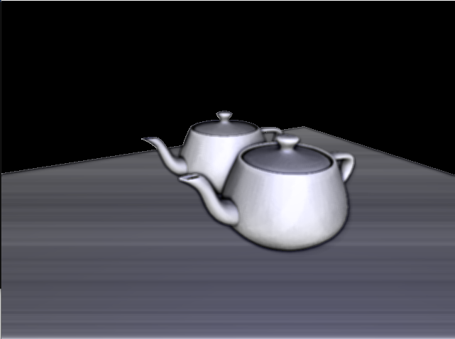

1.  # Ambient Occlusion

Simple SSAO implementaion using OpenGL 
controls :
1- Intensity (L and K)
2- Radius (O and P)
3- Kernal size (M and N)

* This is one of the educational projects of the FRR course (Fast Realistic Rendering) in the Masters of Computer Graphics in UPC

 

